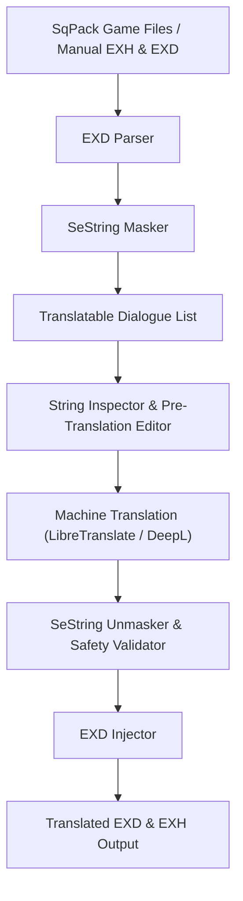

# Interpresona — FFXIV Dialogue & Interface Text Translation Studio (v1.9.28)

Interpresona is a premium, high-performance desktop application designed for extracting, translating, inspecting, and injecting Final Fantasy XIV (FFXIV) game sheets (`.exh` / `.exd` binary formats). Built entirely from scratch in Python with zero external execution dependencies, it guarantees absolute data preservation while maintaining FFXIV control codes, variables, and color formatting tags.

---

## 🌟 Key Features & Latest Enhancements (v1.9.28)

- **Simplified Step-by-Step Guided Wizard GUI (`simple_gui.py`)**:
  - **Step 1: Data Source Selection**: Live auto-detection of FFXIV SqPack game directory, extracted `.exh`/`.exd` folder, or single file pair. Includes the new **Searchable Sheet Selector Dialog (`SheetSearchDialog`)** to quickly search and filter any game sheet by name (e.g. `Addon`, `Item`, `Quest`, `Action`, `Status`).
  - **Step 2: Translator Configuration**: Configure LibreTranslate (local/private server) or DeepL API engines with instant connection diagnostic tests.
  - **Step 3: Destination Output**: Set target output folder with real-time path validation.
  - **Step 4: Execution & Event Terminal**: Real-time progress tracking bar, terminal console log, and direct access to string inspection.

- **Pre-Execution Manual Translation Preservation**:
  - Perform manual translations in the Inspector before starting mass translation. Manually edited strings are **100% preserved**, skipped from machine translation requests, and written directly to the target output game files.

- **SeString-Safe Control Code & Placeholder Masking**:
  - Safely masks binary control codes (color changes, speaker identifiers, name variable lookups, `{0}`, `{1}`) into secure placeholders to prevent NMT engines from corrupting game files.
  - Automatic placeholder validation restores original text if an external MT engine alters a control token, preventing client crashes.

- **Ultra High-End Slate & Violet Dark Theme (Zero White Borders)**:
  - Immersive Windows 10/11 Dark Titlebar integration via DWM API.
  - Custom `DarkScrolledText` and flat dark `ttk.Scrollbar` / `ttk.Treeview` styling with zero white borders, zero 3D bevels, and smooth dark contours.

- **Dual-Mode Architecture & Inspection Suite**:
  - **String Inspector (`StringInspectorWindow`)**: Filter and search strings by status (*In Attesa*, *Tradotti*, *Manuali*, *Bypass*, *Errori*).
  - **Manual String Editor (`EditStringDialog`)**: Quick double-click inline string editing with placeholder completeness checks.

---

## 🔄 Workflow Diagram



---

## 📁 Project Architecture & Structure

```
Interpresona/
├── run_gui.py                    # Main startup entry point for the Desktop Wizard GUI
├── README.md                     # Comprehensive project documentation
├── LICENSE                       # MIT Open Source License
└── interpresona/
    ├── __init__.py               # Package metadata & version info (v1.9.28)
    ├── simple_gui.py             # Streamlined Step-by-Step Wizard & Pop-up Suite
    ├── gui.py                    # Legacy tabbed GUI mode
    ├── core/
    │   ├── sqpack.py             # Binary SqPack archive and index reader
    │   ├── parser.py             # Parser for EXH schema structures and EXD rows
    │   ├── injector.py           # Recompiler and injector for translated sheets
    │   ├── masker.py             # SeString variable masking engine
    │   ├── session.py            # Translation state save/load utilities (.ffxivts)
    │   └── translator.py         # DeepL & LibreTranslate integration wrappers
    └── tests/
        ├── run_all_tests.py      # Independent audit runner for the 32-test suite
        ├── test_parser.py        # Binary reader & parser unit tests
        ├── test_pipeline.py      # End-to-end extraction and injection unit tests
        └── mock_generator.py     # Random mock EXH/EXD byte generator
```

---

## ⚙️ Installation & Running

This project uses `uv` as its Python package and environment manager.

1. **Clone the repository**:
   ```bash
   git clone https://github.com/Keyain-Zasky/Interpresona.git
   cd Interpresona
   ```

2. **Launch the Application**:
   ```bash
   uv run python run_gui.py
   ```

3. **Run Full Audit Test Suite (32 Tests)**:
   ```bash
   uv run python interpresona/tests/run_all_tests.py
   ```

---

## 📜 License

This project is licensed under the MIT License. See the [LICENSE](file:///C:/Users/d.paolozzi/Documents/antigravity/beautiful-bose/LICENSE) file for more details.
