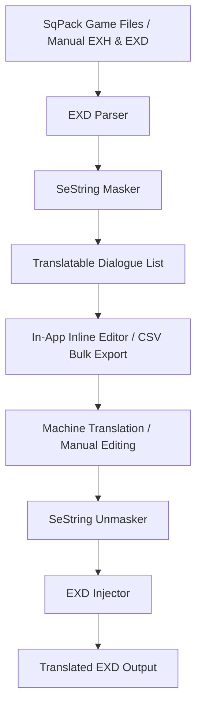

# Interpresona — FFXIV Dialogue & Interface Text Translation Tool

Interpresona is a premium, high-performance desktop application designed for extracting, translating, and injecting Final Fantasy XIV (FFXIV) game sheets (`.exh` / `.exd` formats). Built entirely from scratch in Python with zero external execution dependencies, it guarantees absolute data preservation while maintaining FFXIV control codes, variables, and color formatting tags.

---

## Key Features

- **Dual-Mode Architecture**:
  - **Manual Mode**: Directly browse and open isolated `.exh`/`.exd` files extracted from third-party tools.
  - **SqPack Game Loader**: Point the application directly to your FFXIV game installation folder to automatically map and decompress active archives on the fly.
- **Smart Filter Pipeline**:
  - Automatically isolates translatable dialogue text, stripping away thousands of technical metadata files and internal technical keys (e.g. `TEXT_` and `KEY_` placeholders).
- **SeString-Safe Masking**:
  - Safely masks binary control codes (color changes, speaker identifiers, name variable lookups) into secure placeholders (like `⟪VAR_0⟫`) to prevent machine translation engines or manual edits from corrupting game files.
- **Flexible Exporter / Importer**:
  - Export extracted text to standard CSV formats for automated bulk processing (Google Translate, DeepL, LibreTranslate) and re-import them with a single click.
- **Integrated Machine Translation (MT)**:
  - Perform automated in-app translations using DeepL or LibreTranslate API keys.
- **Modern Premium Interface**:
  - High-fidelity dark mode with clean tab routing, search/filter bars, interactive custom pill buttons, and visual focus indicators.

---

## How It Works



*The .exd page data is rebuilt with recalculated string pointers, while all original variable bytes are preserved.*

---

## Technical Details & Architecture

### 1. Game Data Extraction (SqPack Reader)
The `SqPackReader` reads FFXIV retail assets from the `sqpack/` directory. FFXIV organizes assets using index files (`.index`) and data archives (`.dat` files).
- **Path Hashing**: Paths are hashed using the bitwise-NOT of CRC32 for the lowercased ASCII text (`~crc32(path)`).
- **Index Lookup**: It maps folder and filename hashes to locate the data block position (data archive ID and byte offset) within the target `.dat` archive.
- **Decompression**: The compressed data blocks are read and parsed using raw zlib deflate (`decompress(chunk, -15)`).

### 2. Schema and Sheet Structure (.exh & .exd)
- **EXH Schema**: Defines the row size, column definitions, and depth layout. It maps column types (such as `0x0000` for Strings, `0x0001` for Booleans, and others representing different integer sizes).
- **EXD Pages**: Contains rows grouped in pages.
- **Row Formats**:
  - **Flat Rows (row_type = 1)**: Simple, contiguous database rows.
  - **Sub-Rows (row_type = 2)**: Nested rows under a single row ID (common in quests and dialogue sheets). The first 2 bytes of the payload contain the sub-row ID.
- **String Pointers**: FFXIV string pointers are 4 bytes. In flat sheets, the offset is typically stored shifted to the upper 16 bits of the field. In sub-row files (and some flat quest dialogue files), they are stored as standard 32-bit big-endian offsets. The parser automatically detects this on the fly.

### 3. Dialogue Text Masking Engine
To protect the integrity of the game's formatting during translation, localized variables, text styling instructions, and macro instructions are masked:
- **Control Codes**: FFXIV uses `0x02` prefix bytes followed by variable-length parameters to handle conditional dialogue blocks, color rendering, and character name insertion (e.g. `<Clickable>`, `<If(PlayerGender)>`).
- **Placeholder Generation**: The `mask` logic extracts these bytes, saves them in an internal dictionary, and replaces them with user-friendly tokens (e.g., `⟪VAR_0⟫`).
- **Safety Verification**: During translation saving or CSV importing, the engine validates that all placeholders are preserved to prevent runtime client crashes.

---

## Detailed Directory Map

```
Interpresona/
├── run_gui.py                    # Main startup script for the Tkinter desktop GUI
├── README.md                     # Comprehensive project documentation
├── LICENSE                       # MIT Open Source License
└── interpresona/
    ├── gui.py                    # Visual layout, themes, filters, and editor bindings
    ├── core/
    │   ├── sqpack.py             # Binary SqPack archive and index reader
    │   ├── parser.py             # Parser for EXH schema structures and EXD rows
    │   ├── injector.py           # Recompiler and injector for translated sheets
    │   ├── masker.py             # SeString variable masking engine
    │   ├── session.py            # Translation state save/load utilities (.ffxivts)
    │   └── translator.py         # DeepL & LibreTranslate integration wrappers
    └── tests/
        ├── run_all_tests.py      # Independent test runner for the test suite
        ├── test_parser.py        # Binary reader & parser unit tests
        ├── test_pipeline.py      # End-to-end extraction and injection unit tests
        └── mock_generator.py     # Random mock EXH/EXD byte generator for test assertions
```

---

## Installation & Running

This project uses `uv` as its Python package and environment manager.

1. **Clone the repository**:
   ```bash
   git clone https://github.com/Keyain-Zasky/Interpresona.git
   cd Interpresona
   ```

2. **Run the Application**:
   ```bash
   uv run python run_gui.py
   ```

3. **Run Unit Tests**:
   ```bash
   uv run python interpresona/tests/run_all_tests.py
   ```

---

## License

This project is licensed under the MIT License. See the [LICENSE](file:///C:/Users/d.paolozzi/Documents/antigravity/beautiful-bose/LICENSE) file for more details.
